# Jarkom-Modul-4-E06-2023
Berikut adalah repository dari kelompok E06 untuk pengerjaan Praktikum Modul 4 Jaringan Komputer. Repository ini akan berisikan dokumentasi pengerjaan subnetting dan routing.

# Anggota Kelompok
| Nama | NRP | 
| --- | --- |
| Muhammad Hafidh Rosyadi | 5025211013 |
| Kartika Diva Asmara Gita | 5025211039 |

# Dokumentasi Pengerjaan VLSM di GNS3
## Subnetting VLSM
Menentukan jumlah subnet pada topologi.
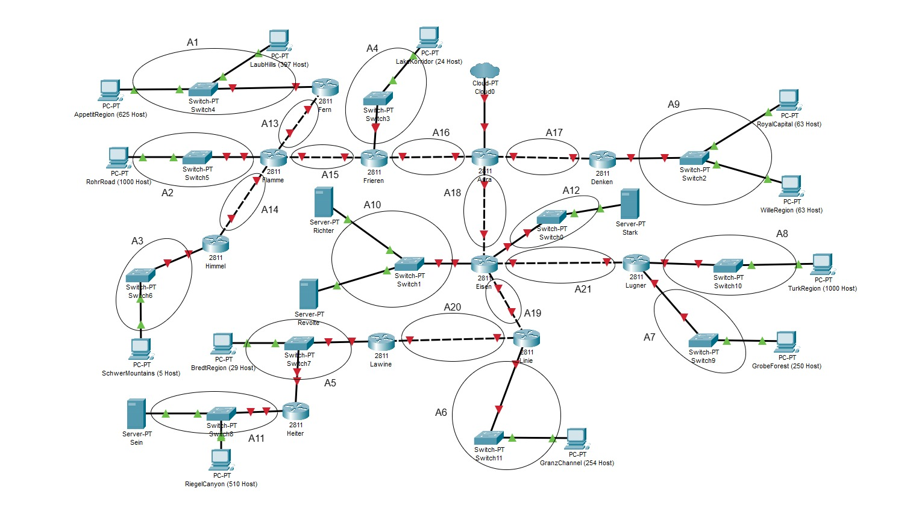

Menentukan jumlah alamat IP yang dibutuhkan oleh tiap subnet.
| Subnet | Jumlah IP | Netmask | 
| --- | --- | --- |
| A1 | 1023 | /21 |
| A2 | 1001 | /22 | 
| A3 | 6 | /29 |
| A4 | 25 | /27 |
| A5 | 31 | /26 |
| A6 | 255 | /23 |
| A7 | 251 | /24 |
| A8 | 1001 | /22 |
| A9 | 127 | /24 |
| A10 | 3 | /29 |
| A11 | 512 | /22 |
| A12 | 2 | /30 |
| A13 | 2 | /30 |
| A14 | 2 | /30 |
| A15 | 2 | /30 |
| A16 | 2 | /30 |
| A17 | 2 | /30 |
| A18 | 2 | /30 |
| A19 | 2 | /30 |
| A20 | 2 | /30 |
| A21 | 2 | /30 |
| Total | 4255 | /19 |

Berdasarkan total IP dan netmask yang dibutuhkan, Subnet besar yang dibentuk memiliki NID `192.209.0.0` dengan Netmask `/19`.

## Tree VLSM
Menghitung pembagian IP berdasarkan NID dan Netmask yang didapatkan.
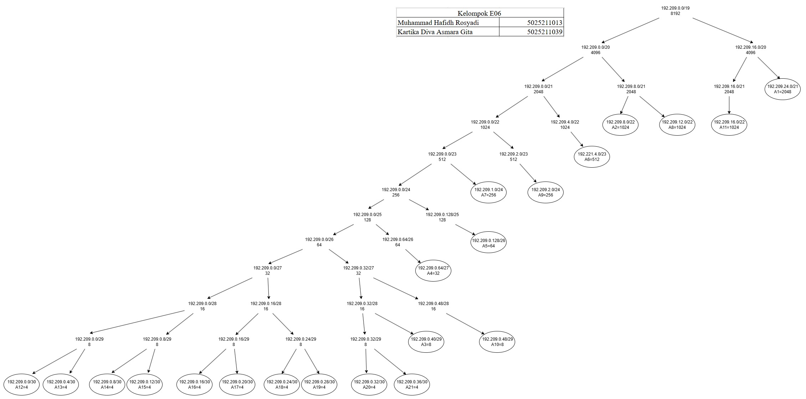

Dari Tree di atas akan mendapat pembagian IP sebagai berikut.
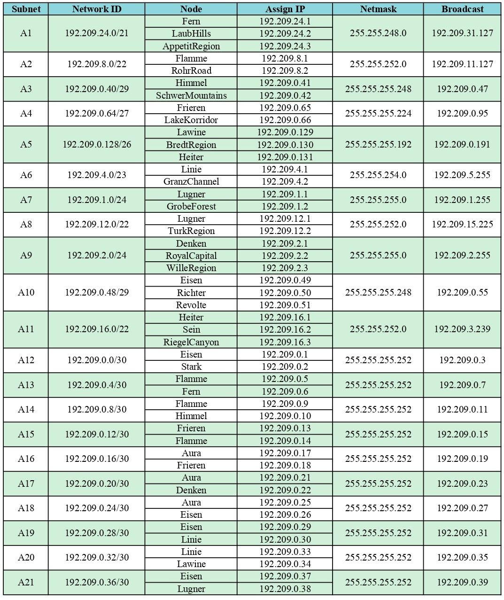

## Configuration VLSM
Mengatur Network Configuration masing-masing interface pada setiap node.

### Router
- Aura
```
auto eth0
iface eth0 inet dhcp

#A16 Aura-Frieren
auto eth1
iface eth1 inet static
	address 192.209.0.17
	netmask 255.255.255.252

#A17 Aura-Denken
auto eth2
iface eth2 inet static
	address 192.209.0.21
	netmask 255.255.255.252

#A18 Aura-Eisen
auto eth3
iface eth3 inet static
	address 192.209.0.25
	netmask 255.255.255.252
```
- Frieren
```
#A16 Aura-Frieren
auto eth0
iface eth0 inet static
	address 192.209.0.18
	netmask 255.255.255.252
	gateway 192.209.0.17

#A15 Frieren-Flamme
auto eth1
iface eth1 inet static
	address 192.209.0.13
	netmask 255.255.255.252

#A4 Frieren-PC Lake Korridor
auto eth2
iface eth2 inet static
	address 192.209.0.65
	netmask 255.255.255.224
```
- Flamme
```
#A15 Frieren-Flamme
auto eth0
iface eth0 inet static
	address 192.209.0.14
	netmask 255.255.255.252
	gateway 192.209.0.13

#A13 Flamme-Fern
auto eth1
iface eth1 inet static
	address 192.209.0.5
	netmask 255.255.255.252

#A2 Flamme-PC Rohr Road
auto eth2
iface eth2 inet static
	address 192.209.8.1
	netmask 255.255.252.0

#A14 Flamme-Himmel
auto eth3
iface eth3 inet static
	address 192.209.0.9
	netmask 255.255.252.252
```
- Fern
```
#A13 Flamme-Fern
auto eth0
iface eth0 inet static
	address 192.209.0.6
	netmask 255.255.255.252
	gateway 192.209.0.5

#A1 Fern-Switch4 
#(PC Laub Hills, PC Appetit Region)
auto eth1
iface eth1 inet static
	address 192.209.24.1
	netmask 255.255.248.0
```
- Himmel
```
#A14 Flamme-Himmel
auto eth0
iface eth0 inet static
	address 192.209.0.10
	netmask 255.255.255.252
	gateway 192.209.0.9

#A3 Himmel-PC Schwer Mountains
auto eth1
iface eth1 inet static
	address 192.209.0.41
	netmask 255.255.255.248
```
- Denken
```
#A17 Aura-Denken
auto eth0
iface eth0 inet static
	address 192.209.0.22
	netmask 255.255.255.252
	gateway 192.209.0.21

#A9 Denken-Switch2 
#PC Royal Capital, PC Wille Region
auto eth1
iface eth1 inet static
	address 192.209.2.1
	netmask 255.255.255.0
```
- Eisen
```
#A18 Aura-Eisen
auto eth0
iface eth0 inet static
	address 192.209.0.26
	netmask 255.255.255.252
	gateway 192.209.0.25

#A10 Eisen-Switch1
#Server Ritcher, Server Revolte
auto eth1
iface eth1 inet static
	address 192.209.0.49
	netmask 255.255.255.248

#A12 Eisen-Stark
auto eth2
iface eth2 inet static
	address 192.209.0.1
	netmask 255.255.255.252

#A21 Eisen-Lugner
auto eth3
iface eth3 inet static
	address 192.209.0.37
	netmask 255.255.255.252

#A19 Eisen-Linie
auto eth4
iface eth4 inet static
	address 192.209.0.29
	netmask 255.255.255.252
```
- Lugner
```
#A21 Eisen-Lugner
auto eth0
iface eth0 inet static
	address 192.209.0.38
	netmask 255.255.255.252
	gateway 192.209.0.37

#A8 Lugner-PC Turki Region
auto eth1
iface eth1 inet static
	address 192.209.12.1
	netmask 255.255.252.0

#A7 Lugner-PC Grobe Forest
auto eth2
iface eth2 inet static
	address 192.209.1.1
	netmask 255.255.255.0
```
- Linie
```
#A19 Eisen-Linie
auto eth0
iface eth0 inet static
	address 192.209.0.30
	netmask 255.255.255.252
	gateway 192.209.0.29

#A20 Linie-Lawine
auto eth1
iface eth1 inet static
	address 192.209.0.33
	netmask 255.255.255.252

#A6 Linie-PC Granz Channel
auto eth2
iface eth2 inet static
	address 192.209.4.1
	netmask 255.255.254.0
```
- Lawine
```
#A20 Linie-Lawine
auto eth0
iface eth0 inet static
	address 192.209.0.34
	netmask 255.255.255.252
	gateway 192.209.0.33

#A5 Lawine-Switch7
#PC Breadt Region, Router Heiter
auto eth1
iface eth1 inet static
	address 192.209.0.129
	netmask 255.255.255.192
```
- Heiter
```
#A5 Lawine-Heiter
auto eth0
iface eth0 inet static
	address 192.209.0.131
	netmask 255.255.255.192
	gateway 192.209.0.129

#A11 Heiter-Switch8
#Server Sein, PC Riegel Canyon
auto eth1
iface eth1 inet static
	address 192.209.16.1
	netmask 255.255.252.0
```
### Client
- Lake Korridor
```
#A4 Frieren-PC Lake Korridor
auto eth0
iface eth0 inet static
	address 192.209.0.66
	netmask 255.255.255.224
	gateway 192.209.0.65
```
- Laub Hills
```
#A1 Fern-PC Laub Hills
auto eth0
iface eth0 inet static
	address 192.209.24.2
	netmask 255.255.248.0
	gateway 192.209.24.1
```
- Appetit Region
```
#A1 Fern-PC Appetit Region
auto eth0
iface eth0 inet static
	address 192.209.24.3
	netmask 255.255.248.0
	gateway 192.209.24.1
```
- Rohr Road
```
#A2 Flamme-PC Rohr Road
auto eth0
iface eth0 inet static
	address 192.209.8.2
	netmask 255.255.252.0
	gateway 192.209.8.1
```
- Schwer Mountains
```
#A3 PC Schwer Mountains
auto eth0
iface eth0 inet static
	address 192.209.0.42
	netmask 255.255.255.248
	gateway 192.209.0.41
```
- Royal Capital
```
#A9 Denken-PC Royal Capital
auto eth0
iface eth0 inet static
	address 192.209.2.2
	netmask 255.255.255.0
	gateway 192.209.2.1
```
- Wille Region
```
#A9 Denken-PC Wille region
auto eth0
iface eth0 inet static
	address 192.209.2.3
	netmask 255.255.255.0
	gateway 192.209.2.1
```
- Turki Region
```
#A8 Lugner-PC Turki Region
auto eth0
iface eth0 inet static
	address 192.209.12.2
	netmask 255.255.252.0
	gateway 192.209.12.1
```
- Grobe Forest
```
#A7 Lugner-PC Grobe Forest
auto eth0
iface eth0 inet static
	address 192.209.1.2
	netmask 255.255.255.0
	gateway 192.209.1.1
```
- Granz Channel
```
#A6 Linie-PC Granz Channel
auto eth0
iface eth0 inet static
	address 192.209.4.2
	netmask 255.255.254.0
	gateway 192.209.4.1
```
- Breadt Region
```
#A5 Lawine-PC Breadt Region
auto eth0
iface eth0 inet static
	address 192.209.0.130
	netmask 255.255.255.192
	gateway 192.209.0.129
```
- Riegel Canyon
```
#A11 Heiter-PC Riegel Canyon
auto eth0
iface eth0 inet static
	address 192.209.16.3
	netmask 255.255.252.0
	gateway 192.209.16.1
```
### Server
- Ritcher
```
#A10 Eisen-Server Ritcher
auto eth0
iface eth0 inet static
	address 192.209.0.50
	netmask 255.255.255.248
	gateway 192.209.0.49
```
- Revolte
```
#A10 Eisen-Server Revolte
auto eth0
iface eth0 inet static
	address 192.209.0.51
	netmask 255.255.255.248
	gateway 192.209.0.49
```
- Stark
```
#A12 Eisen-Stark
auto eth0
iface eth0 inet static
	address 192.209.0.2
	netmask 255.255.255.252
	gateway 192.209.0.1
```
- Sein
```
#A11 Heiter-Server Sein
auto eth0
iface eth0 inet static
	address 192.209.16.2
	netmask 255.255.252.0
	gateway 192.209.16.1
```

## Statics Route Configuration
Berikut adalah konfigurasi routing.

- Fern
```
route add -net 0.0.0.0 netmask 0.0.0.0 gw 192.209.0.5	#default A1,A13
```
- Himmel
```
route add -net 0.0.0.0 netmask 0.0.0.0 gw 192.209.0.9	#default A3,A14
```
- Flamme
```
route add -net 0.0.0.0 netmask 0.0.0.0 gw 192.209.0.13	#default A2,A13,A14,A15
route add -net 192.209.24.0 netmask 255.255.248.0 gw 192.209.0.6	#A1
route add -net 192.209.0.40 netmask 255.255.255.248 gw 192.209.0.10	#A3
```
- Frieren
```
route add -net 0.0.0.0 netmask 0.0.0.0 gw 192.209.0.17	#default A4,A15,A16
route add -net 192.209.24.0 netmask 255.255.248.0 gw 192.209.0.14	#A1
route add -net 192.209.0.4 netmask 255.255.255.252 gw 192.209.0.14	#A13
route add -net 192.209.8.0 netmask 255.255.252.0 gw 192.209.0.14	#A2
route add -net 192.209.0.40 netmask 255.255.255.248 gw 192.209.0.14	#A3
route add -net 192.209.0.8 netmask 255.255.255.252 gw 192.209.0.14	#A14
```
- Denken
```
route add -net 0.0.0.0 netmask 0.0.0.0 gw 192.209.0.21	#default A9,A17
```
- Heiter
```
route add -net 0.0.0.0 netmask 0.0.0.0 gw 192.209.0.129	#default A11,A5
```
- Lawine
```
route add -net 0.0.0.0 netmask 0.0.0.0 gw 192.209.0.33	#default A20,A5
route add -net 192.209.16.0 netmask 255.255.252.0 gw 192.209.0.131	#A11
```
- Linie
```
route add -net 0.0.0.0 netmask 0.0.0.0 gw 192.209.0.29	#default A19,A6,A20
route add -net 192.209.0.128 netmask 255.255.255.192 gw 192.209.0.34	#A5
route add -net 192.209.16.0 netmask 255.255.252.0 gw 192.209.0.34	#A11
```
- Lugner
```
route add -net 0.0.0.0 netmask 0.0.0.0 gw 192.209.0.37	#default A8,A7,A21
```
- Eisen
```
route add -net 0.0.0.0 netmask 0.0.0.0 gw 192.209.0.25	#default A18,A10,A12,A21,A19
route add -net 192.209.0.128 netmask 255.255.255.192 gw 192.209.0.30	#A5
route add -net 192.209.16.0 netmask 255.255.252.0 gw 192.209.0.30	#A11
route add -net 192.209.0.32 netmask 255.255.255.252 gw 192.209.0.30	#A20
route add -net 192.209.4.0 netmask 255.255.254.0 gw 192.209.0.30	#A6
route add -net 192.209.12.0 netmask 255.255.252.0 gw 192.209.0.38	#A8
route add -net 192.209.1.0 netmask 255.255.255.0 gw 192.209.0.38	#A7
```
- Aura
```
#eth1
route add -net 192.209.24.0 netmask 255.255.248.0 gw 192.209.0.18	#A1
route add -net 192.209.0.4 netmask 255.255.255.252 gw 192.209.0.18	#A13
route add -net 192.209.8.0 netmask 255.255.252.0 gw 192.209.0.18	#A2
route add -net 192.209.0.40 netmask 255.255.255.248 gw 192.209.0.18	#A3
route add -net 192.209.0.8 netmask 255.255.255.252 gw 192.209.0.18	#A14
route add -net 192.209.0.12 netmask 255.255.255.252 gw 192.209.0.18	#A15
route add -net 192.209.0.64 netmask 255.255.255.224 gw 192.209.0.18	#A4
#eth2
route add -net 192.209.2.0 netmask 255.255.255.0 gw 192.209.0.22	#A9
#eth3
route add -net 192.209.0.48 netmask 255.255.255.248 gw 192.209.0.26	#A10
route add -net 192.209.0.0 netmask 255.255.255.252 gw 192.209.0.26	#A12
route add -net 192.209.0.36 netmask 255.255.255.252 gw 192.209.0.26	#A21
route add -net 192.209.12.0 netmask 255.255.252.0 gw 192.209.0.26	#A8
route add -net 192.209.1.0 netmask 255.255.255.0 gw 192.209.0.26	#A7
route add -net 192.209.0.28 netmask 255.255.255.252 gw 192.209.0.26	#A19
route add -net 192.209.4.0 netmask 255.255.254.0 gw 192.209.0.26	#A6
route add -net 192.209.0.32 netmask 255.255.255.252 gw 192.209.0.26	#A20
route add -net 192.209.0.128 netmask 255.255.255.192 gw 192.209.0.26	#A5
route add -net 192.209.16.0 netmask 255.255.252.0 gw 192.209.0.26	#A11
```

## Testing
Client Rohr Road melakukan ping untuk Wille Region dengan ip `192.209.2.3` dan Grobe Forest dengan ip `192.209.1.2`
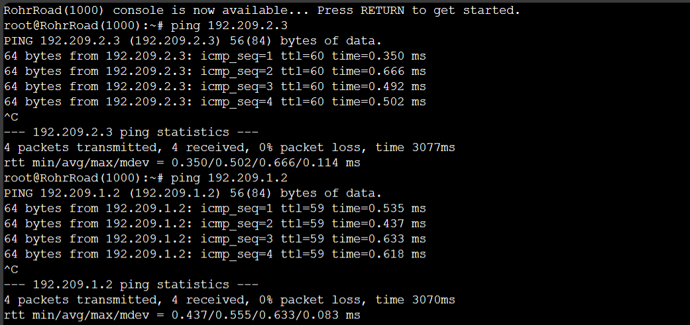


# Dokumentasi Pengerjaan CIDR di Cisco
## Subnetting CIDR

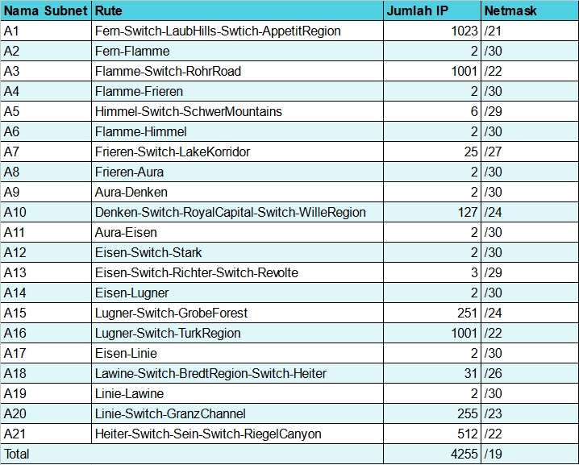

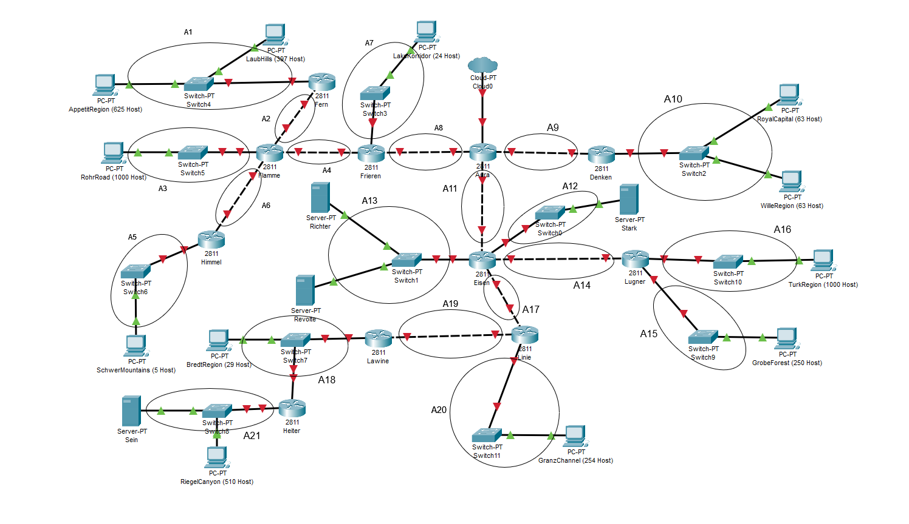

## penggabungan dan Tree
Penggabungan subnet subnet kecil menjadi satu subnet besar dan dipecah dengan tree agar mendapat pembagian IP.

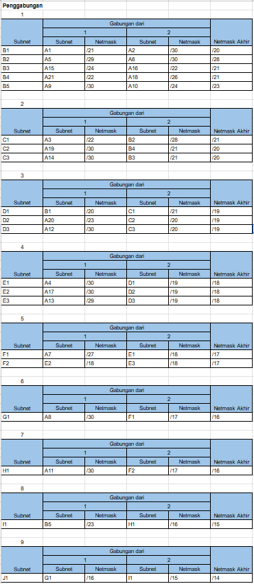

dengan bantuan table subnet berikut:


diperoleh tree sebagai berikut:

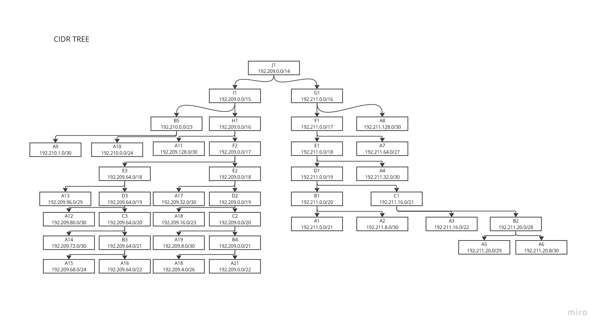

dari Tree dan penggabungan diperoleh:

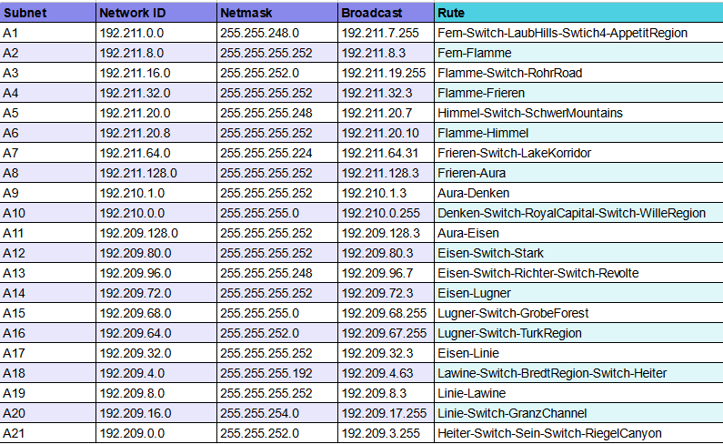

## Subnetting CIDR di Cisco Packet Tracer

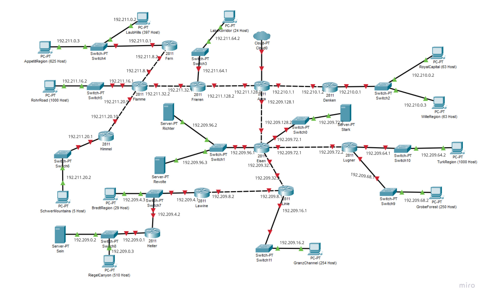

## Routing CIDR di Cisco Packet Tracer

<!-- masih belum nanti kuisi -->

## Hasil Testing pengiriman packet

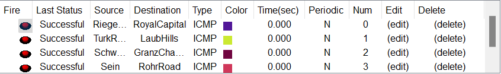